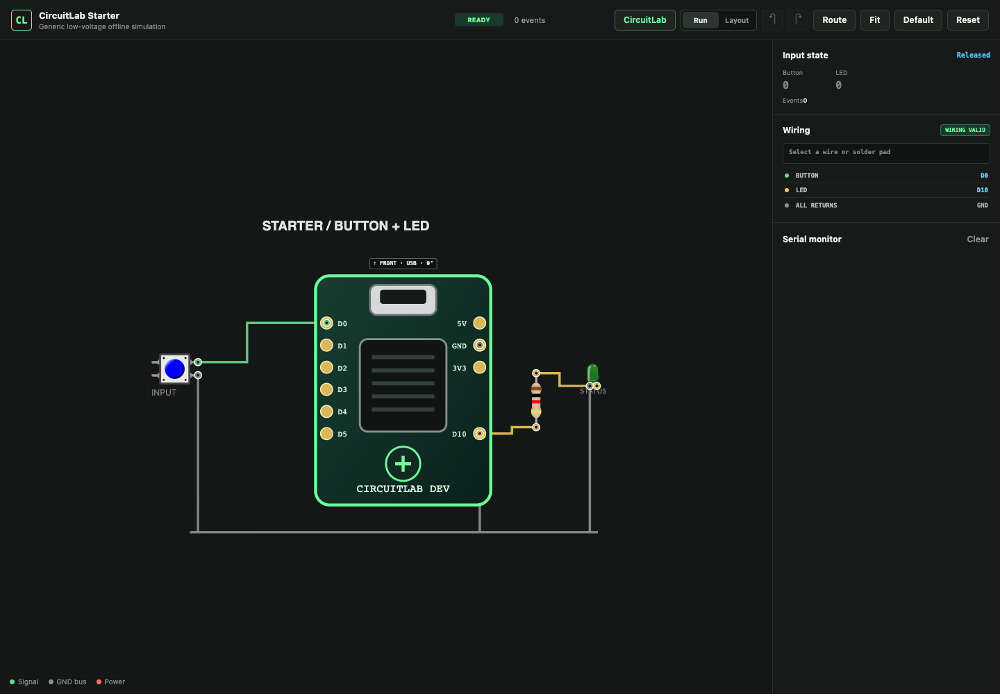

# CircuitLab

CircuitLab is a portable, local-first circuit-development workspace. Its Hardware Library covers exact packaged silicon, development boards, single-board computers, sensor modules, and displays with evidence-backed images, pin tables, and original interactive top views.

It is both a standalone application template and a Codex Skill. The repository has no runtime dependency on Rune or Sindri. Rune can consume the shared core through its own adapter, and Sindri assets can be imported read-only.

## What is included

- Single-browser PWA with a visual Hardware Library plus Projects, Workbench, Touchpoints, Fixture, HIL, and Reports.
- `component-package/v1`, `fixture-package/v1`, `hil-plan/v1`, and `fixture-driver/v1` contracts.
- Immutable JSON component registry with rebuildable SQLite indexes.
- Latest-revision search for exact chip MPNs and exact board/module products.
- Fail-closed official image discovery plus deterministic original SVG top views derived from documented dimensions and pin tables.
- DigiKey and Mouser read-only procurement snapshots.
- Fixture map, CSV, DXF, KiCad PCB, Gerber, drill, BOM, and assembly outputs.
- Mock and replay HIL with expiring, hash-bound Arm sessions.
- PCB fabrication and fixture workflows remain optional secondary capabilities.

## Quick start

```bash
python3 scripts/init_lab.py ~/CircuitLabProjects/my-lab
python3 scripts/validate_instance.py ~/CircuitLabProjects/my-lab
python3 scripts/start_lab.py ~/CircuitLabProjects/my-lab --port 8766
```

Open <http://127.0.0.1:8766>.

Run the complete software-only acceptance loop:

```bash
python3 scripts/verify_platform.py
python3 -m unittest discover -s tests -p 'test_*.py'
```

Search the hardware catalog and generate the redistributable starter views:

```bash
python3 scripts/component_assets.py search BME280
python3 scripts/component_assets.py search ESP32-S3
python3 scripts/generate_builtin_catalog.py --install
```

Run the complete evidence-to-hardware workflow. Online capture is explicit; without
`--online`, CircuitLab stays offline and only inspects its local evidence cache.

```bash
python3 scripts/hardware_pipeline.py run --online
```

The workflow captures official source bytes and hashes into a local-only cache,
normalizes exact product metadata, renders the shared `circuitlab-top-style/v1`
top view, checks every pin-to-anchor mapping, installs immutable revisions, and
writes an auditable report for the PWA.

Packaged-chip acquisition remains strict; board and module assets use the immutable general registry after their exact product and version are confirmed.

## Install as a Codex Skill

Clone or download this repository into `$CODEX_HOME/skills/circuitlab`, or install the GitHub repository with Codex's Skill installer. Invoke it as `$circuitlab`.

## Safety

CircuitLab's generic boundary is current-limited embedded work at or below 24 V. Real serial, flashing, power, restore, purchasing, and fabrication are fail-closed until separately verified and authorized. Generated manufacturing files are always marked `GENERATED_UNVERIFIED_DO_NOT_FABRICATE`; software-only evidence is marked `PHYSICAL_UNVERIFIED`.

## Licensing

CircuitLab code and original starter assets are MIT licensed. The vendored Wokwi Elements runtime retains its upstream MIT license. Product-specific Wokwi board artwork is intentionally not included because its redistribution status requires separate review. See `THIRD_PARTY_NOTICES.md`.


